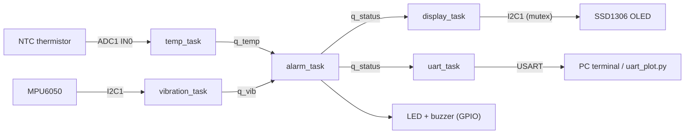

# Industrial Condition Monitoring System


A real-time machine-health monitor built on **STM32 + FreeRTOS**. It measures
**temperature** and **vibration**, shows live status on an **OLED**, streams
telemetry over **UART**, and raises an **alarm** (LED + buzzer) when readings go
abnormal - the basic idea behind predictive maintenance on motors, pumps and fans.

> **Status:** 🚧 In progress - see [ROADMAP.md](ROADMAP.md).

## Features

- Multi-task FreeRTOS design with priorities, "latest value" queues and an I2C bus mutex
- NTC thermistor read through the **ADC** (oversampling + moving average, Beta equation)
- MPU6050 accelerometer over **I2C** at 500 Hz, AC-RMS vibration over a 128 ms window (gravity removed)
- Three-level alarm (NORMAL / WARNING / CRITICAL) with **hysteresis** and a fail-safe for dead sensors
- SSD1306 **OLED** status screen
- **UART** CSV telemetry + Python live plotter / logger
- Hardware-independent logic covered by host unit tests (run in GitHub Actions)

## Hardware

| Part | Suggested | Interface |
|---|---|---|
| MCU board | STM32F103C8T6 "Blue Pill" or Nucleo-F446RE | - |
| Temperature | 10 kΩ NTC thermistor (B = 3950) + 10 kΩ fixed resistor | ADC1 |
| Vibration | MPU6050 (GY-521) | I2C1 |
| Display | SSD1306 128x64 OLED | I2C1 (shared) |
| PC link | USB-UART adapter (not needed on Nucleo) | USART |
| Alarm | LED + active buzzer (via transistor) | GPIO |

Wiring and CubeMX settings: [docs/pin_mapping.md](docs/pin_mapping.md).

## Architecture



Details (task table, priorities, timing budget): [docs/architecture.md](docs/architecture.md).

## Repository layout

```
.
├── app/            application tasks + hardware-independent logic
├── sensors/        MPU6050 driver
├── tests/          host-side unit tests (no hardware needed)
├── tools/          Python live plot / logger for the UART stream
├── docs/           architecture, pin mapping, test plan, images
├── .github/        CI workflow (runs the host tests)
├── ROADMAP.md
└── LICENSE
```

The STM32CubeIDE-generated folders (`Core/`, `Drivers/`, `Middlewares/`, the `.ioc`
file) live next to these in the project root.

## Getting started

1. **Create the CubeMX project** for your board using the settings in
   [docs/pin_mapping.md](docs/pin_mapping.md) (ADC1, I2C1 @ 400 kHz, USART @ 115200,
   FreeRTOS with a 1000 Hz tick, GPIO labels `ALARM_LED`, `BUZZER`, `STATUS_LED`).
2. **Add the sources:** copy `app/` and `sensors/` into the project, then in
   CubeIDE add them as source folders and add both to *C/C++ Build → Settings →
   Include paths*.
3. **Add the OLED library:** copy `ssd1306.c/.h`, `ssd1306_fonts.c/.h` and
   `ssd1306_conf.h` from [afiskon/stm32-ssd1306](https://github.com/afiskon/stm32-ssd1306)
   and point its config at `hi2c1`.
4. **Start the app:** in `main.c` (or `freertos.c`) add

   ```c
   #include "app.h"
   /* ... inside the USER CODE section that runs before the scheduler starts ... */
   app_init();
   ```
5. **Build, flash, open a serial terminal** at 115200 baud.

If your UART is not `huart1`, change `APP_UART_HANDLE` in `app/app_config.h`.

### Serial output

```
t_ms,temp_c,vib_rms_g,state,fault
1000,27.4,0.012,NORMAL,0
2000,27.5,0.013,NORMAL,0
3000,51.2,0.011,WARNING,0
```

`fault` bit0 = temperature sensor invalid, bit1 = vibration sensor invalid.

### Live plot

```
pip install -r tools/requirements.txt
python tools/uart_plot.py COM5 --log logs/run1.csv
```

## Configuration

All thresholds, periods, priorities and stack sizes are in
[`app/app_config.h`](app/app_config.h). The demo thresholds are:

| Quantity | Warning | Critical | Hysteresis |
|---|---|---|---|
| Temperature | 50 °C | 70 °C | 3 °C |
| Vibration (AC RMS) | 0.30 g | 1.00 g | 0.05 g |

## Tests

Hardware-independent logic (alarm hysteresis, RMS, moving average, NTC conversion,
number formatting) is unit-tested on the PC:

```
gcc -std=c99 -Wall -Wextra -Iapp tests/test_logic.c app/alarm_logic.c app/dsp_utils.c app/ntc.c app/fmt_utils.c -lm -o test_logic
./test_logic
```

On-hardware test cases: [docs/testing.md](docs/testing.md).

## Demo

_Add photos of the setup and a demo video link here (put images in `docs/images/`)._

## License

MIT - see [LICENSE](LICENSE).
