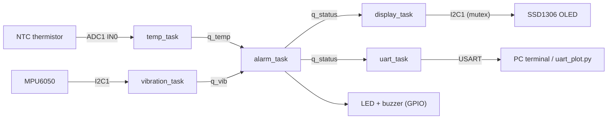

# Architecture

## Data flow

## Tasks

| Task | Priority (above idle) | Period | Stack (words) | Responsibility |
|---|---|---|---|---|
| `vibration_task` | 4 (highest) | 2 ms (500 Hz) | 256 | Read accelerometer, compute AC-RMS / peak over 64 samples |
| `alarm_task` | 3 | 100 ms | 192 | Evaluate thresholds with hysteresis, drive LED/buzzer, publish status |
| `temp_task` | 2 | 100 ms | 192 | ADC read (16x oversample), NTC conversion, moving average |
| `display_task` | 1 | 500 ms | 256 | Render status on the OLED |
| `uart_task` | 1 | 1000 ms | 256 | CSV telemetry + heartbeat LED |

Priorities follow the deadlines: the 2 ms sampling task must never wait for slow
work (display, UART), so it is the highest priority and the slow tasks are the lowest.

## Inter-task communication

| Object | Type | Producer → Consumer | Purpose |
|---|---|---|---|
| `g_q_temp` | queue, length 1 | temp_task → alarm_task | latest temperature sample |
| `g_q_vib` | queue, length 1 | vibration_task → alarm_task | latest vibration sample |
| `g_q_status` | queue, length 1 | alarm_task → display / uart | latest system status |
| `g_i2c_mutex` | mutex | vibration_task, display_task | serialise access to I2C1 |

The queues have length 1 and are written with `xQueueOverwrite()` and read with
`xQueuePeek()`. Consumers therefore always see the **newest** value, and several
consumers can read the same status without stealing it from each other. This suits
monitoring data, where an old sample is worthless.

## Alarm logic

`alarm_evaluate()` (see `app/alarm_logic.c`) escalates immediately when a value reaches
a threshold, but only de-escalates after the value falls a hysteresis margin below it,
so a reading hovering around a limit does not flicker between states.
Overall state = worst of the temperature and vibration states. If a sensor is invalid
(open/short NTC, MPU6050 not responding) the state is raised to at least WARNING, so a
dead sensor never reports "all normal".

## Vibration processing

The accelerometer magnitude `sqrt(ax² + ay² + az²)` includes ~1 g of gravity. The task
collects 64 samples (128 ms at 500 Hz) and computes the RMS of the deviation from the
window mean (`dsp_rms_ac`), which removes gravity/DC and leaves the vibration energy.

## I2C timing budget

At 400 kHz, one 6-byte accelerometer burst read is about 0.3 ms, so sampling every 2 ms
uses roughly 15 % of the bus. The OLED is the problem: a full 1 KB frame takes about
25 ms. While `display_task` holds the mutex for that time, `vibration_task` cannot read
(it times out after 5 ms and drops the sample), so the RMS window has gaps every
`DISPLAY_TASK_PERIOD_MS`.

Current mitigation: slow display refresh (500 ms). Planned fix (see ROADMAP): send the
frame page by page (8 pages of 128 bytes, ~3 ms each) and release the mutex between pages,
or use I2C DMA. This is a good real-world example of a shared-bus scheduling problem.

## FreeRTOS settings that matter

- `configTICK_RATE_HZ = 1000` (2 ms period needs 1 ms tick resolution)
- Mutexes enabled, `vTaskDelayUntil` included, `configCHECK_FOR_STACK_OVERFLOW = 2`
- `heap_4`; total heap sized for ~5 task stacks, 3 queues, 1 mutex (see `pin_mapping.md`)
- Use a hardware timer (not SysTick) as the HAL timebase when FreeRTOS owns SysTick
